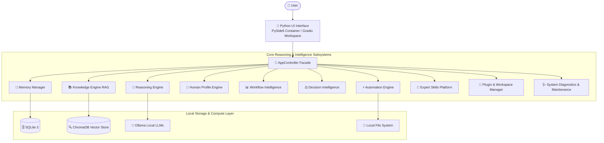

<div align="center">

# 🧠 AetherMind Cortex
### **Human-Centered AI Reasoning Engine**

*A 100% offline, privacy-first, human-centered AI platform that understands, remembers, reasons, and acts alongside you.*

[](https://github.com/KAVATIJOHNSHREYAN/AETHERMIND-CORTEX)
[](https://www.python.org/)
[](https://github.com/KAVATIJOHNSHREYAN/AETHERMIND-CORTEX)
[](LICENSE)
[](https://github.com/KAVATIJOHNSHREYAN/AETHERMIND-CORTEX)

---

[Key Features](#-key-features) • [Architecture](#-architecture) • [Project Structure](#-project-structure) • [Roadmap](#-development-roadmap) • [Quick Start](#-quick-start--installation) • [Ecosystem](#-aethermind-ecosystem)

</div>

---

## 👁 Vision

**AetherMind Cortex** is a **Human-Centered AI Reasoning Engine** designed to understand users beyond simple prompt-response dynamics. Traditional LLM interfaces act as transactional chatbots—forgetting context, ignoring personal workflow habits, and providing generic answers. 

Cortex transforms this paradigm into a personal cognitive partner. Operating **100% offline**, Cortex builds a long-term memory trace, indexes your local knowledge documents, learns your preferences, analyzes your workflows, evaluates complex decision trade-offs, and provides explainable step-by-step reasoning while maintaining complete local data sovereignty.

---

## 💡 Core Philosophy

Traditional AI operates on a basic single-step loop. **AetherMind Cortex** introduces a human-centered cognitive processing pipeline:

```
┌────────────────────────────────────────────────────────────────────────────────────────┐
│ TRADITIONAL AI:    User Prompt  ───────────────────────────────────────► Direct Response  │
└────────────────────────────────────────────────────────────────────────────────────────┘

┌────────────────────────────────────────────────────────────────────────────────────────┐
│ AETHERMIND CORTEX:                                                                      │
│ Human ──► Goal ──► Context ──► Memory ──► Knowledge ──► Reasoning ──► Decision          │
│                                                                            │           │
│ Action ◄──────────────────────── Explanation ──────────────────────────────┘           │
└────────────────────────────────────────────────────────────────────────────────────────┘
```

---

## ✨ Key Features

| Category | Capability | Description |
| :--- | :--- | :--- |
| 🛡 **Offline & Privacy First** | **Zero Telemetry** | Runs 100% locally with Ollama, SQLite, and ChromaDB. Zero cloud APIs or data transmission. |
| 🧠 **Cognitive Reasoning** | **Multi-Step Pipeline** | Intent detection, ambiguity breakdown, alternative solution generation, and trade-off analysis. |
| 📚 **Knowledge Engine (RAG)** | **Local Document Indexing** | Ingest `.pdf`, `.docx`, `.txt`, `.md`, and `.py` codebases into vector stores with hybrid retrieval. |
| 💾 **Long-Term Memory** | **Episodic & Vector Storage** | Remembers key facts, project preferences, and personal insights across chat sessions. |
| 👤 **Human Profile Engine** | **Adaptive Personalization** | Dynamically adapts tone, explanation depth, coding style, and learning goals to user preferences. |
| 📊 **Decision Intelligence** | **MCDA & Risk Assessment** | Multi-criteria decision scoring across technical, financial, and time risks with transparent rankings. |
| ⚡ **Local Automation** | **Safe Script & File Tasks** | Task scheduling, local file management, document batch processing, and script execution. |
| 🧩 **Ecosystem Plugins** | **Modular Platform** | Secure plugin manager with explicit permission controls and multi-workspace session state restoration. |
| 🖥 **Desktop Native** | **Dual Interface** | Modern PySide6 native desktop window container alongside a responsive Gradio web workspace. |

---

## 🏗 Architecture



---

## 📂 Project Structure

```
AetherMind-Cortex/
├── app/                      # Central Application Controller (Facade)
│   ├── controller.py         # Main AppController Facade orchestrating 12 subsystems
│   └── main.py               # Gradio web interface launcher
├── core/                     # Core Domain Logic & Subsystem Engines
│   ├── reasoning_engine.py   # Intent detection & multi-step cognitive pipeline
│   ├── memory_manager.py     # SQLite & ChromaDB vector memory store
│   ├── knowledge_engine.py   # RAG document parser & vector collection indexer
│   ├── profile_manager.py    # User identity, preferences, & goal tracking engine
│   ├── workflow_engine.py   # Workflow analyzer & task intelligence
│   ├── decision_engine.py   # Multi-criteria decision analysis (MCDA) engine
│   ├── skill_manager.py      # Expert skill registration & prompt injection
│   ├── automation_engine.py  # File automation & local script execution runner
│   ├── plugin_manager.py    # Plugin dynamic loader & permission registry
│   ├── workspace_manager.py # Multi-workspace switcher & session persistence
│   ├── backup_manager.py    # Full zip backup generation & restore manager
│   ├── diagnostics.py       # System health diagnostics & self-healing repair
│   ├── llm_engine.py         # Local Ollama client & model discovery
│   ├── session_manager.py   # Conversation sessions CRUD
│   ├── config_manager.py    # YAML configuration manager
│   ├── settings.py           # User preferences & runtime settings
│   ├── logger.py             # System log rotation manager
│   └── version.py            # Version & app metadata definitions
├── database/                 # Persistence Layer
│   ├── connection.py         # SQLite connection manager
│   ├── init_db.py            # Database schema initializers (v1.0 schema)
│   ├── memory_vector/        # ChromaDB memory vector storage
│   └── knowledge_vector/     # ChromaDB knowledge document vector storage
├── ui/                       # Modern Glassmorphic UI Subsystem
│   ├── layout.py             # Main layout assembly
│   ├── theme.py              # Custom CSS & Gradio themes
│   └── components/           # Modular UI tab components
│       ├── chat.py           # Streaming chat workspace
│       ├── knowledge_tab.py  # Document ingestion & RAG dashboard
│       ├── memory_tab.py     # Memory viewer & manager
│       ├── profile_tab.py    # Human profile & goal manager
│       ├── workflow_tab.py   # Workflow intelligence dashboard
│       ├── decision_tab.py   # Decision evaluation & MCDA dashboard
│       ├── skills_tab.py     # Expert skills manager
│       ├── automation_tab.py # Task automation & reminder manager
│       ├── plugins_tab.py    # Ecosystem plugin & workspace manager
│       ├── diagnostics_tab.py# Health check & self-healing dashboard
│       ├── settings_tab.py   # Platform settings
│       ├── about_tab.py      # Version & phase milestone information
│       └── status_bar.py     # Live status indicator bar
├── utils/                    # Utility Functions & Security
│   └── security.py           # SHA-256 secret hashing & base64 local encryption
├── config/                   # System Configuration
│   └── default.yaml          # YAML default system configuration
├── docs/                     # Documentation Suite
│   ├── USER_GUIDE.md         # Comprehensive end-user manual
│   └── DEVELOPER_GUIDE.md    # Developer architecture & API guide
├── tests/                    # Unit & Integration Test Suite (32 Tests)
│   ├── test_integration.py   # End-to-end integration & facade tests
│   └── test_*.py             # Subsystem unit tests
├── pyside_app.py             # PySide6 Native Desktop Window Container
├── aethermind.spec           # PyInstaller Standalone Build Specification
├── CHANGELOG.md              # Version release history
├── requirements.txt          # Python dependencies manifest
└── README.md                 # Flagship project documentation
```

---

## 🛠 Technology Stack

- **Core Engine:** Python 3.12 / 3.13
- **User Interface:** Gradio (Web Workspace) & PySide6 (Native Qt Container)
- **Primary Relational Storage:** SQLite 3 (Thread-Safe Persistence)
- **Vector Database:** ChromaDB (Offline Vector Embeddings & Similarity Search)
- **Local Model Execution:** Ollama API (`llama3`, `mistral`, `gemma`, `phi3`, etc.)
- **Text & Embedding Processing:** Sentence Transformers & HuggingFace Transformers
- **Document Parsing:** PyPDF, Python-Docx
- **Config & Validation:** PyYAML & Pydantic
- **Testing Framework:** PyTest

---

## 🗺 Development Roadmap

| Phase | Milestone Name | Key Capabilities Delivered | Status |
| :---: | :--- | :--- | :---: |
| **Phase 1** | **Core Architecture** | Modular Python facade, SQLite database schema, Gradio layout UI. | ✅ **Completed** |
| **Phase 2** | **Offline Model Engine** | Ollama local model integration, health checks, & model switching. | ✅ **Completed** |
| **Phase 3** | **Memory Architecture** | Short-term session memory & ChromaDB episodic long-term vector memory. | ✅ **Completed** |
| **Phase 4** | **Knowledge Engine (RAG)** | Ingestion for PDF, DOCX, TXT, MD, Code & hybrid semantic document search. | ✅ **Completed** |
| **Phase 5** | **Human Profile System** | User identity, preferences, goal tracking, & adaptive response tuning. | ✅ **Completed** |
| **Phase 6** | **Cognitive Reasoning** | Intent detection, trade-off analysis, alternative generation, & confidence scores. | ✅ **Completed** |
| **Phase 7** | **Workflow Intelligence** | Productivity insights, task intelligence, & workflow analyzer. | ✅ **Completed** |
| **Phase 8** | **Decision Intelligence** | Multi-criteria decision analysis (MCDA), weighted scoring, & risk evaluation. | ✅ **Completed** |
| **Phase 9** | **Expert AI Skills** | 6 AI Expert Skills (Coding, Research, Writing, Data, Learning, Project Planner). | ✅ **Completed** |
| **Phase 10** | **Local Automation** | Script execution runner, file automation, remiders, & task scheduler. | ✅ **Completed** |
| **Phase 11** | **Desktop Experience** | PySide6 desktop launcher container, plugin loader, & multi-workspace switcher. | ✅ **Completed** |
| **Phase 12** | **Production Release** | Health diagnostics engine, self-healing repair, security layer, & PyInstaller build. | ✅ **Completed** |

---

## 🚀 Quick Start & Installation

### 1. Prerequisites
- **Python:** Version `3.12+` (or `3.13`)
- **Ollama:** Installed and running locally ([Download Ollama](https://ollama.ai))

### 2. Installation Steps
```bash
# 1. Clone the repository
git clone https://github.com/KAVATIJOHNSHREYAN/AETHERMIND-CORTEX.git
cd AETHERMIND-CORTEX

# 2. Create and activate a virtual environment
python -m venv venv

# Windows PowerShell:
.\venv\Scripts\Activate.ps1

# Linux / macOS:
source venv/bin/activate

# 3. Install required Python packages
pip install -r requirements.txt

# 4. Pull your preferred local Ollama model
ollama pull llama3
```

### 3. Launching AetherMind Cortex

- **Native PySide6 Desktop GUI Window Container:**
  ```bash
  python pyside_app.py
  ```

- **Gradio Web Workspace Interface:**
  ```bash
  python app/main.py
  ```
  *Open your web browser at `http://127.0.0.1:7860`.*

### 4. Running the Test Suite
```bash
pytest tests/ -v
```

---

## 🖼 Interface Showcase

*(Placeholder sections for platform screenshots)*

<details>
<summary>📸 Click to expand UI screenshot previews</summary>

#### Main Chat Workspace & Cognitive Reasoning Log


#### Knowledge Base RAG Ingestion Dashboard


#### Decision Intelligence Engine


#### System Health Diagnostics & Self-Healing Repair


</details>

---

## 🔒 Security & Privacy Guarantees

- **100% Offline Core:** Every vector calculation, memory lookup, and model call runs strictly on your local machine.
- **Zero Cloud Dependencies:** No data is sent to external cloud servers, metrics trackers, or telemetry endpoints.
- **Local Hashing & Encryption:** Sensitive profile payloads and local settings use SHA-256 hashing and local base64 data obfuscation.
- **Complete User Ownership:** You have full access to inspect, export, edit, or delete all databases located in `database/`.

---

## 🌌 AetherMind Ecosystem Integration

AetherMind Cortex serves as the intelligent cognitive core of the broader **AetherMind AI System**:

```
 ┌────────────────────────────────────────────────────────┐
 │ 📐 AetherMind Genesis                                  │
 │ AI Software System Architect & Implementation Blueprint │
 └───────────────────────────┬────────────────────────────┘
                             │
                             ▼
 ┌────────────────────────────────────────────────────────┐
 │ 🧠 AetherMind Cortex (v1.0 Flagship Release)          │
 │ Human-Centered AI Reasoning Engine (Cognitive Core)    │
 └───────────────────────────┬────────────────────────────┘
                             │
            ┌────────────────┴────────────────┐
            ▼                                 ▼
 ┌──────────────────────┐        ┌──────────────────────┐
 │ 🌐 AetherMind Nexus  │        │ 🎨 AetherMind Studio │
 │ Multi-Agent Platform │        │ Visual Workflow      │
 └──────────────────────┘        └──────────────────────┘
                             │
                             ▼
 ┌────────────────────────────────────────────────────────┐
 │ 🖥️ AetherMind OS                                      │
 │ Unified AI Operating Environment                       │
 └────────────────────────────────────────────────────────┘
```

---

## 🤝 Contributing

Contributions are welcome! If you'd like to improve AetherMind Cortex:

1. Fork the project repository.
2. Create your Feature Branch (`git checkout -b feature/AmazingFeature`).
3. Commit your changes (`git commit -m 'Add some AmazingFeature'`).
4. Ensure all unit tests pass (`pytest tests/ -v`).
5. Push to the branch (`git push origin feature/AmazingFeature`).
6. Open a Pull Request.

Please read `docs/DEVELOPER_GUIDE.md` for architectural design standards.

---

## 📜 License

Distributed under the **MIT License**. See `LICENSE` for more information.

---

## 🙏 Acknowledgements

- **Ollama** for bringing fast, offline local LLM execution to developer machines.
- **ChromaDB** for powerful local vector similarity search.
- **Gradio & PySide6** for modern user interface rendering.

---

<div align="center">

**AetherMind Cortex is the flagship Human-Centered AI Reasoning Engine powering the next generation of privacy-first artificial intelligence.**

Made with ❤️ by [Kavati John Shreyan](https://github.com/KAVATIJOHNSHREYAN)

</div>
